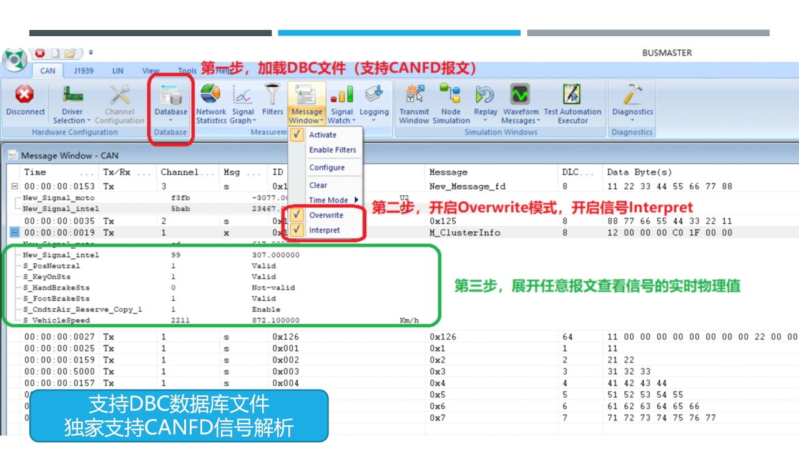

# BUSMUST 使用笔记

## BUSMASTER

- 切换十进制/十六进制：`view` - `Hex`
- 加载 DBC
  - `Database` - `Associate`，然后选择 DBC 文件
  - `Message Window`: 勾选 `Overwrite` 和 `Interpret`

  

## BUSMUST SDK

- 初始化 `can.Bus` 时需要设置 `tres=True`，以打开终端电阻
- 收发两个 `can.Bus` 都初始化后，发送端才能正常发送 CAN 报文，否则会报 TIMEOUT 的错误
