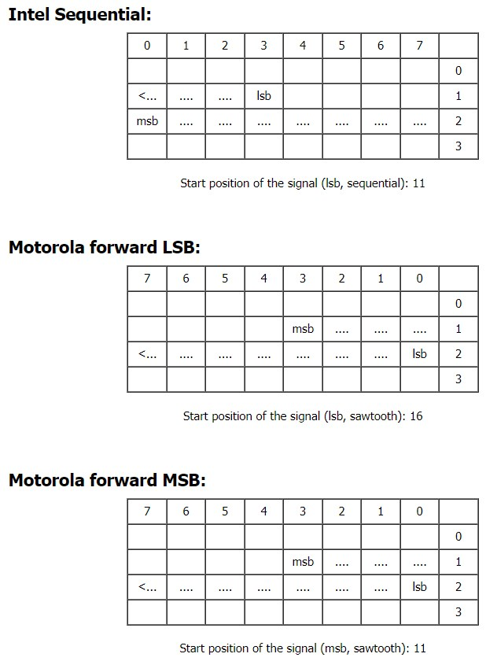

# CAN 协议使用笔记

## DBC

### 周期型报文、事件型报文、事件周期型报文

在汽车通信网络中，DBC 文件（Data Base CAN，CAN 数据库文件）定义了报文格式、信号和参数。报文可以根据其发送机制分为以下三种类型：周期型报文、事件型报文和事件周期型报文。下面是它们的区别和特点：

#### 1. 周期型报文（Cyclic Message）

- **定义**：周期型报文是按照固定的时间间隔发送的报文。
- **发送机制**：无论是否有数据变化，报文都会在预定的时间间隔内持续发送。
- **优点**：这种报文类型确保了接收端能够定期收到数据，适用于需要持续监控的信号，如速度、转速等。
- **缺点**：可能会占用较多的总线带宽，因为即使数据没有变化，报文也会被发送。

#### 2. 事件型报文（Event-Triggered Message）

- **定义**：事件型报文是基于特定事件触发发送的报文。
- **发送机制**：只有在数据发生变化或特定事件发生时，报文才会被发送。
- **优点**：这种报文类型可以减少总线负载，因为只有在需要时才发送数据，适用于不频繁变化的信号，如开关状态、故障码等。
- **缺点**：如果事件发生频繁，可能会导致总线负载不稳定。

#### 3. 事件周期型报文（Event-Cyclic Message）

- **定义**：事件周期型报文结合了周期型和事件型报文的特点。
- **发送机制**：在数据发生变化时立即发送报文，并且如果在一定时间内没有事件发生，会按照固定的时间间隔发送报文。
- **优点**：这种报文类型确保了重要事件能够及时传输，同时也保证了在没有事件发生时接收端能够定期收到数据，适用于既需要实时性又需要稳定性的信号。
- **缺点**：设计和实现相对复杂，需要在事件和周期之间找到平衡。

#### 对比总结

- **周期型报文**：固定时间间隔发送，保证数据更新频率高，但可能占用较多带宽。
- **事件型报文**：基于事件触发发送，节省带宽，但可能导致数据更新不稳定。
- **事件周期型报文**：事件触发和定期发送结合，兼顾实时性和稳定性，但实现复杂。

选择哪种报文类型取决于具体应用需求和系统设计。例如，安全关键系统可能更倾向于周期型报文以确保数据的持续更新，而非关键系统可能更倾向于事件型报文以节省带宽。事件周期型报文则适用于需要兼顾实时性和系统稳定性的场景。

## CAN Specification

- 远程帧
  - 远程帧是一种特殊的CAN帧，用于请求其他节点发送对应的数据帧。它不包含数据字段，仅包含标识符（Identifier）和数据长度代码（DLC）。
  - 发送远程帧的节点希望获取某个特定标识符的数据，因此它使用与该数据帧相同的标识符发送远程帧。

```text
By sending a REMOTE FRAME a node requiring data may request another node to
send the corresponding DATA FRAME. The DATA FRAME and the corresponding
REMOTE FRAME are named by the same IDENTIFIER.
```

## 参考资料

- [CAN Specification][4]

- [周立功CAN总线技术干货知识库][3]

- [CANFD每秒最多可以发送多少帧报文？][2]

- [CAN 字节序：Inter、Motorola forward LSB、Motorola forward MSB][1]

  

  [1]: https://www.race-technology.com/wiki/index.php/CANInterface/ByteOrdering
  [2]: https://mp.weixin.qq.com/s/VwFUit2CY8SFY9Xo5Vll8Q
  [3]: https://mp.weixin.qq.com/s/aM8hdcnOqvHBwE2ZxOOttg
  [4]: http://esd.cs.ucr.edu/webres/can20.pdf
