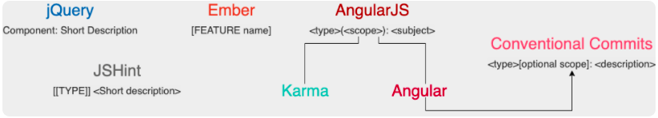

# 《Go 语言项目开发实战》分析笔记

## 第5章 规范设计（下）：commit 信息风格迥异、难以阅读，如何规范？

### Q1：这一章的内容属于哪一类别？

计算机/编程语言/Golang.

### Q2：这一章的内容是什么？

- 为什么好的 Commit Message 至关重要？
- Commit Message 的规范有哪些？
- Angular 规范
  - Header
  - Body
  - Footer
  - Revert Commit
- Commit 相关的3个重要内容
  - 提交频率
  - 合并提交
    - git rebase 命令介绍
    - 合并提交操作示例
  - 修改 Commit Message
    - `git commit --amend`
    - `git rebase -i`
- Commit Message 规范自动化
- 总结

### Q3：这一章的大纲是什么？

### Q4：作者想要解决什么问题？

### Q5：这一章的关键词是什么？

### Q6：这一章的关键句是什么？

#### 为什么好的 Commit Message 至关重要？

- 一个好的 Commit Message 至关重要：
  - 可以使自己或者其他开发人员能够 **清晰地知道每个 commit 的变更内容**，方便快速浏览变更历史，比如可以直接略过文档类型或者格式化类型的代码变更。
  - 可以基于这些 Commit Message **进行过滤查找**，比如只查找某个版本新增的功能：`git log --oneline --grep "^feat|^fix|^perf"`。
  - 可以基于规范化的 Commit Message **生成 Change Log**。
  - 可以依据某些类型的 Commit Message **触发构建或者发布流程**，比如当 type 类型为 feat、fix 时我们才触发 CI 流程。
  - **确定语义化版本的版本号。** 比如 fix 类型可以映射为 PATCH 版本，feat 类型可以映射为 MINOR 版本。带有 BREAKING CHANGE 的 commit，可以映射为 MAJOR 版本。

#### Commit Message 的规范有哪些？

  

#### Angular 规范

- Angular 规范其实是一种语义化的提交规范（Semantic Commit Messages），所谓语义化的提交规范包含以下内容：
  - Commit Message 是语义化的：Commit Message 都会被归为一个有意义的类型，用来说明本次 commit 的类型。
  - Commit Message 是规范化的：Commit Message 遵循预先定义好的规范，比如 Commit Message 格式固定、都属于某个类型，这些规范不仅可被开发者识别也可以被工具识别。

  ```markdown
  <type>[optional scope]: <description>
  // blank line
  [optional body]
  // blank line
  [optional footer(s)]
  ```

- Commit 相关的3个重要内容
- Commit Message 规范自动化

### Q7：作者是怎么论述的？

### Q8：作者解决了什么问题？

### Q9：我有哪些疑问？

### Q10：这一章说得有道理吗？为什么？

### Q11: 这一章讨论的知识的本质是什么？

### Q12: 这一章讨论的知识的第一原则是什么？

### Q13：这一章讨论的知识的结构是怎样的？

### Q14：这一章讨论的知识为什么是这样的？为什么发展成这样？为什么需要它？

### Q15：有哪些相似的知识？它们之间的联系是什么？

### Q16：其他领域/学科有没有相关的知识？日常生活中有没有类似的现象？

### Q17: 这一章对我有哪些用处/帮助/启示？

### Q18: 我如何应用这一章的知识去解决问题？

