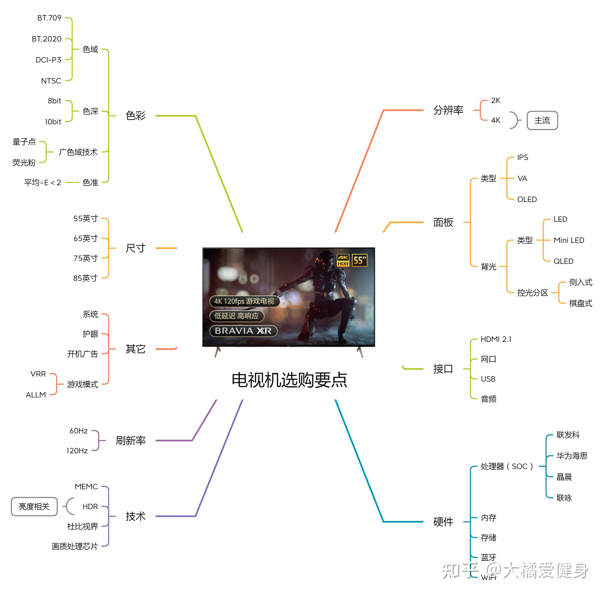

# 电视机选购指南

## 电视机参数

  

## 电视选购攻略

- [2022电视机推荐+选购指南-双12更新（选购要点/产品型号/品牌推荐/有无开机广告等）- 大橘爱健身的文章 - 知乎][1]

- [这些电视不要买！2022年那些不推荐的液晶电视（50至65寸） - 筒隐陆奥Official的文章 - 知乎][2]

- 技术参数
  - MEMC（Motion Estimation, Motion Compensation，运动画质补偿）：选择有 MEMC 的
  - 刷新率：一般电视都是60hz，高端电视和某些中端电视是120hz
  - 广色域：色域覆盖在130%BT.709/85%NTSC以上的电视
  - 亮度：要实现真HDR画面亮度应能达到600nit以上
  - 棋盘式控光分区

### 色彩

#### 色域

- 色域(color gamut)或者色彩空间(color space)基本是一个意思，表示颜色的集合，描述的是色彩覆盖范围。

- 「色域容积」和「色域覆盖率」是两个不同的概念。
  - 「色域覆盖率」是指显示器的色域能够覆盖 sRGB 色域的比例，最多只能是 100%。
  - 「色域容积」是指显示器的色域与 sRGB 色域的面积比例，可以大于 100%。

- 广色域（也被叫做高色域）
  - 由于色彩种类的增多，使得画面中的色彩过渡显得更加自然，能够非常优秀地体现出纯色，例如红色、黄色，
  - 以及强烈的对比色，使得画面的层次感也更加分明，从而展现出更多细节和更加接近真实的效果。
  - 但同时人的肤色会偏红，不正常，所以广色域电视更加考验电视厂商的屏幕调校功力。

- HDR代表高动态范围，与现有SDR（标准动态范围）相比，可显示更大的亮度范围（动态范围） ― 从最暗到最亮。

- BT709 vs BT2020
  - BT2020是HDR色域，目前顶级的OLED电视大概能覆盖个80%。
  - BT709是SDR色域，色域超过100%BT709即为广色域电视。
  - 目前电影行业将BT2020的一部分即DCI-P3作为HDR色域，导致目前最重要的色域标准就是DCI-P3。

> 结论：选 BT2020 或 DCI-P3.

#### 色深

- 8bit vs 10bit
  - 8bit是指每红、蓝、绿里每种都能细分为2的8次方种颜色，再互相搭配，总共能显示16.7百万色。
  - 10bit就是总共能显示10.7亿色。

- 像素点抖动技术（FRC, Frame Rate Control）
  - 通过算法使像素点在不同颜色之间快速切换，利用人眼的视觉暂留效应，从而产生出新的中间色的错觉。
  - 现在市面上最常见的8bit大部分都是6bit抖上来的（俗称：6抖8bit或6bit+FRC）
  - 五千元以下的10bit显示器几乎可以肯定就是8bit抖上来的（俗称：8抖10bit或8bit+FRC）

- 色深 vs  色域
  - 色域是指颜色的区域、范围，色深是指颜色的精细程度（过渡是否平滑自然）。

> 伍注：色域讨论的是连续的颜色，色深讨论的是离散的颜色，即将颜色数字化时的处理。

- 对普通用户来说，8 bit 就够用，日常使用体验没问题。专业用户，建议 10 bit。

> 结论：选 8 bit。

#### 色准

- 色准就是指显示器显示颜色的准确度。

- 衡量色准的参数就是△E，这个值越小说明显示器的色彩偏差越小。

- 色准级别分类
  - △E ≤ 1.5---S级---极好
  - △E 为1.5~3---A级---非常优秀
  - △E 为3~5---B级---优秀
  - △E 为5~8---C级---普通
  - △E >8---D级---很差

- 一般色准在`ΔE<3`左右的显示器，都是比较优秀的。

> 结论：选色准小于3的。

### 刷新率

- 60hz屏幕刷新率加运动补偿功能是够流畅的，120HZ是锦上添花。你能看得出来，但是确实对大多数人来说，60HZ够用。

### 面板

- 面板类型
  - TN (Twisted Nematic)
  - IPS (In-Plane Switching)：俗称「硬屏」
  - VA (Vertical Alignment)：俗称「软屏」
  - OLED (Organic Light-Emitting Diode)

- 不同面板的可视角大小排序
  - `OLED自发光面板>IPS液晶面板>广锐视角VA面板(索尼、三星才有）>普通VA面板`

- 动态响应世界（越短越好）
  - `OLED电视<120Hz电视<60Hz硬屏<60Hz软屏`。

- OLED vs IPS
  - 虽然OLED面板能产生真正的黑色，并具有几乎瞬间完成的像素响应时间速度，但你必须注意烧屏和残像问题。
    此外，OLED不能像一些采用IPS或VA面板的高端LED背光显示器那样明亮。
  - IPS面板的响应时间尽管在传统三大面板技术中算比较快的，但相对OLED面板，还是响应速度较慢，对比度较低，
    再加上IPS的严重漏光问题，导致与OLED相比，黑色偏灰，整体观看体验逊色，但没有烧毁的风险。

### 背光方式

- 侧入式背光
  - 光源来自电视面板的侧面，也就是光源位于长方形的边缘，通过导光板把光线输送到屏幕中央。
  - 优点是可以做超薄电视。

- 直下式背光
  - 整个长方形液晶面板背面，均匀分布着上几百甚至上千颗LED灯珠，使背光可以均匀传达到整个屏幕。
  - 优点就是亮度均匀，漏光控制很好，也可以把把背光面板进行分区，使得每个分区可以独立控制亮度。
  - 缺点是比较厚，做不薄。

- 使用场景
  - 绝大多数中端和中高端机型，为了外观好看，做超薄全面屏，采用侧入式背光。
  - 低端机，和廉价中端机，还有高端机，则普遍采用直下式背光。
  - 直下式背光+硬件级棋盘式控光分区才是“好”，只有直下式背光的话，基本上只是代表这是一款中低端机型。

### 处理器

- [电视机也有性能跑分一说？2022年电视SOC处理器介绍与排名（附电视SOC天梯） - 筒隐陆奥Official的文章 - 知乎][3]

  [1]: https://zhuanlan.zhihu.com/p/265075724
  [2]: https://zhuanlan.zhihu.com/p/341554565
  [3]: https://zhuanlan.zhihu.com/p/433699719
